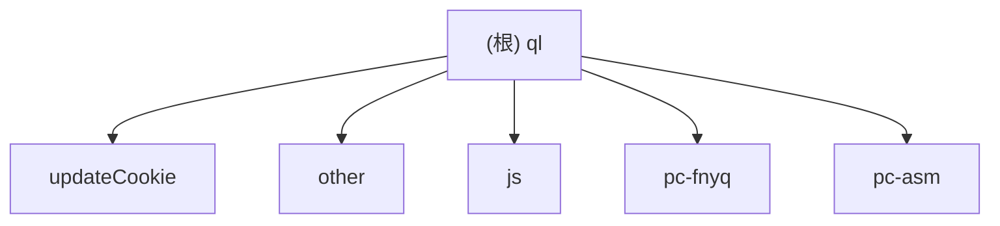

# ql 项目文档

## 变更记录 (Changelog)

- 2026-04-16 18:56:57：执行 `/zcf/init-project` 增量初始化，重建根级索引、模块图、覆盖率与续跑建议。

## 项目愿景

`ql` 是面向青龙（QingLong）运行环境的自动化脚本仓库，聚焦以下能力：

- 品牌/应用签到与任务自动化（Python 与 JavaScript 混合）
- Cookie 抓取、更新、持久化与环境变量同步
- 多通道通知与脚本执行结果反馈
- PC 端图像识别自动化辅助

## 架构总览

- **根目录脚本层**：大量独立业务脚本（按品牌命名）+ 通用工具库
- **模块化目录层**：`updateCookie/`、`other/`、`js/`、`pc-fnyq/`、`pc-asm/`
- **公共基础层**：`ApiRequest.py`、`mytool.py`、`notify.py`、`sendNotify.py`

## 模块结构图

## 模块索引

| 模块路径 | 职责 | 入口/关键文件 | 测试信号 |
|---|---|---|---|
| [`updateCookie/`](./updateCookie/CLAUDE.md) | Cookie 抓包落盘、QL 环境变量写入、Web 接口汇聚 | `server.py`, `updateCookie_Util.py`, `JDLogin.py` | `test.py`（历史存在，当前扫描未读取） |
| [`other/`](./other/CLAUDE.md) | 混合脚本集合（活动任务、抽奖、签到） | `tuchong.py`, `yuyun.py`, `七猫抽奖领宝箱.py` | 未发现标准化测试目录 |
| [`js/`](./js/CLAUDE.md) | 独立 JS 活动脚本（Env 模式） | `bsd.js`, `媓钻.js`, `悦秀会.js` | 未发现标准化测试目录 |
| [`pc-fnyq/`](./pc-fnyq/CLAUDE.md) | Windows 图像识别自动化（京东/淘宝） | `pc-fnyq.py`, `mytool.py` | `test.py`（历史存在，当前扫描未读取） |
| [`pc-asm/`](./pc-asm/CLAUDE.md) | PC 自动化图片资源库 | `*.png`, `CLAUDE.md` | 不适用（资源型模块） |

## 运行与开发

- Python 脚本：直接 `python xxx.py`，依赖以脚本内 import 与项目约定为准
- JS 脚本：青龙/Node 环境执行，常见 Env 模式读取环境变量
- Cookie 更新服务：`updateCookie/server.py` 基于 FastAPI，支持多 host token 提取落盘

## 测试策略

- 当前仓库以“脚本可执行验证 + 目标平台实测”作为主路径
- 仅在部分目录可见 `test.py`，缺少统一测试框架与覆盖率基线
- 建议逐模块补“最小可回归用例”（参数解析、签名算法、关键请求构造）

## 编码规范

- Python/JS 混合仓库，优先保持现有脚本风格兼容
- 减少跨脚本耦合：公共能力优先复用 `ApiRequest.py`、`mytool.py`、`notify.py`
- 对 Cookie、Token、手机号等敏感字段，避免日志明文扩散

## AI 使用指引

- 新增脚本优先采用最小实现（KISS/YAGNI）
- 复用优先级：根工具层 > 模块内工具 > 本地重复实现
- Python 脚本优先参考技能：`.cursor/skills/python-apirequest-style/SKILL.md`
- 文档变更需同步更新模块 `CLAUDE.md` 与 `.claude/index.json`

## 覆盖率与缺口（本次初始化）

- 估算总文件数：`92`（基于阶段 A 可见文件清单）
- 已扫描文件数（路径级清点）：`92/92`（100%）
- 已深读文件数（内容级抽样）：`12/92`（13.0%）
- 模块覆盖占比（内容级，按模块估算）：
  - `updateCookie/`：高（入口+工具+登录路径）
  - `other/`：中（核心大脚本抽样）
  - `js/`：中（入口脚本与函数结构）
  - `pc-fnyq/`：高（主脚本+工具函数）
  - `pc-asm/`：低（资源型目录，仅文档可见）
- 忽略/跳过原因：
  - `.gitignore` 命中：`decode/`, `android-ssl/`, `invalid/*`, `other/node_modules/*`
  - 二进制与大资源：仅记录路径，不读取内容
  - 历史文档提及但本次未见可扫描文件：`decode/`, `android-ssl/`

## 下一步建议（可续跑）

建议优先补扫以下子路径以提升“内容级覆盖率”：

1. `updateCookie/server.py`（剩余路由段与参数差异）
2. `updateCookie/updateCookie_Util.py`（QL API 写入链路）
3. `other/wx朵茜情调生活馆_jm.py` 与 `other/xj.js`（高复杂度脚本）
4. `js/悦秀会.js`（打包/混淆逻辑解构）
5. `pc-asm/` 图片资源与调用脚本的映射关系

---

*本文档由 `/zcf/init-project` 于 2026-04-16 18:56:57 更新。*
