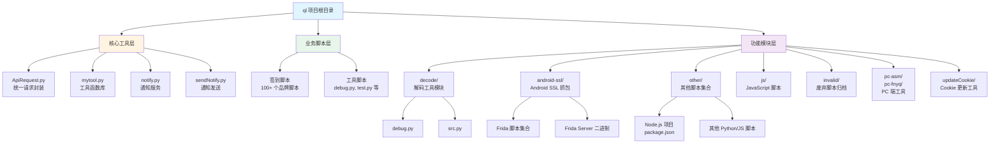

# ql 项目文档

> **初始化时间**: 2025-11-27 16:38:35  
> **项目摘要**: 青龙（ql）自动化脚本集合，包含签到、抓包、通知等功能的 Python/JavaScript 脚本仓库

## 项目愿景

本项目是一个基于青龙（ql）框架的自动化脚本集合，主要用于：
- **自动化签到任务**：各类电商、品牌、应用的每日签到脚本
- **网络抓包工具**：Android SSL 抓包、PC 端抓包工具
- **通知服务**：集成多种通知渠道（微信、Telegram、邮件等）
- **Cookie 管理**：Cookie 更新、调试、备份工具

## 架构总览

项目采用**扁平化 + 模块化**的混合架构：
- **根目录**：核心工具库和大量业务脚本（签到脚本为主）
- **模块目录**：按功能领域划分的独立模块（decode、android-ssl、other、js 等）
- **工具层**：统一的请求封装（ApiRequest）、工具函数（mytool）、通知服务（notify/sendNotify）

### 项目结构图

## 模块索引

### 核心工具模块（根目录）

| 模块/文件 | 说明 | 关键接口 |
|---------|------|---------|
| `ApiRequest.py` | 统一 HTTP 请求封装类 | `ApiRequest`, `ApiMain` |
| `mytool.py` | 通用工具函数库 | `getlistCk()`, `gettime()`, `sleep()` |
| `notify.py` | 通知服务封装 | `send()` 方法 |
| `sendNotify.py` | 多通道通知发送 | 支持 Bark、Server酱、Telegram、邮件等 |

### 功能模块

| 模块路径 | 说明 | 主要文件 |
|---------|------|---------|
| [`decode/`](./decode/CLAUDE.md) | 解码工具模块 | `debug.py`, `src.py` |
| [`android-ssl/`](./android-ssl/CLAUDE.md) | Android SSL 抓包工具 | `frida-android-repinning.js`, `X509TrustManager.js` |
| [`other/`](./other/CLAUDE.md) | 其他脚本集合 | Node.js 项目、各类脚本 |
| [`js/`](./js/CLAUDE.md) | JavaScript 脚本 | `bsd.js`, `媓钻.js`, `悦秀会.js` |
| [`pc-asm/`](./pc-asm/CLAUDE.md) | PC 端自动化工具（ASM） | 图片资源、自动化脚本 |
| [`pc-fnyq/`](./pc-fnyq/CLAUDE.md) | PC 端自动化工具（FNYQ） | `pc-fnyq.py`, `mytool.py` |
| [`updateCookie/`](./updateCookie/CLAUDE.md) | Cookie 更新工具 | `updateCookie_JD.py`, `JDLogin.py` |
| [`invalid/`](./invalid/) | 废弃脚本归档 | 已失效的脚本集合 |

### 业务脚本（根目录，部分示例）

- **品牌签到脚本**：`三养.py`, `三只松鼠.py`, `五谷磨房.py`, `卡西欧.py`, `李宁CLUB.py`, `诺特兰德.py` 等
- **工具脚本**：`debug.py`, `test.py`, `cookiesDebug.py`, `backup_ql.py`, `changeEnv.py` 等

## 全局规范

### 代码规范

1. **Python 编码**：
   - 使用 UTF-8 编码
   - 遵循 PEP 8 风格（部分脚本可能不一致）
   - 脚本头部建议包含 `#!/usr/bin/env python3` 和编码声明

2. **依赖管理**：
   - 核心依赖：`requests`, `urllib3`
   - 通知相关：`wxpusher`, `smtplib`
   - 工具库：`pyautogui`, `pyperclip`（GUI 自动化）
   - 加密解密：`Crypto`（部分脚本使用）

3. **环境变量**：
   - Cookie 通过环境变量传递（格式：`CK_NAME=value1@value2` 或换行分隔）
   - 通知配置通过环境变量设置（如 `wxpusherTopicId`, `wxpusherAppToken`）

4. **错误处理**：
   - 使用 `try-except` 捕获异常
   - 通过 `traceback` 记录详细错误信息
   - 错误信息通过通知服务发送

### 项目约定

1. **脚本命名**：
   - 业务脚本：使用品牌/应用名称（如 `三养.py`, `李宁CLUB.py`）
   - 工具脚本：使用功能描述（如 `mytool.py`, `notify.py`）

2. **模块组织**：
   - 核心工具放在根目录
   - 功能模块放在独立目录
   - 废弃脚本移至 `invalid/` 目录

3. **配置管理**：
   - 全局配置：`config.json`
   - 环境变量：通过青龙面板或 `.env` 文件管理

### 开发流程

1. **新增脚本**：
   - 继承 `ApiRequest` 或使用 `ApiMain` 框架
   - 使用 `mytool.getlistCk()` 获取 Cookie
   - 使用 `notify.send()` 发送通知

2. **测试**：
   - 使用 `debug.py` 设置调试环境
   - 通过 `test.py` 进行单元测试

3. **部署**：
   - 脚本上传至青龙面板
   - 配置环境变量和定时任务

## 技术栈

- **语言**：Python 3.x, JavaScript (Node.js)
- **HTTP 客户端**：`requests` (Python), `got`/`request` (Node.js)
- **自动化工具**：Frida (Android), PyAutoGUI (PC)
- **通知服务**：微信推送、Telegram、邮件、Bark、Server酱

## 统计信息

- **总文件数**：约 449 个 Python/JavaScript 文件
- **核心模块**：8 个功能模块
- **业务脚本**：100+ 个签到/自动化脚本
- **工具脚本**：10+ 个通用工具脚本

## 下一步建议

1. **深度扫描**：
   - 分析 `updateCookie/` 模块的完整实现
   - 梳理各业务脚本的依赖关系
   - 识别可复用的公共组件

2. **文档完善**：
   - 为常用脚本添加使用说明
   - 补充环境变量配置文档
   - 编写开发指南

3. **代码优化**：
   - 统一错误处理机制
   - 提取公共请求逻辑
   - 优化通知服务集成

---

*本文档由 `/zcf/init-project` 命令自动生成，最后更新时间：2025-11-27 16:38:35*

